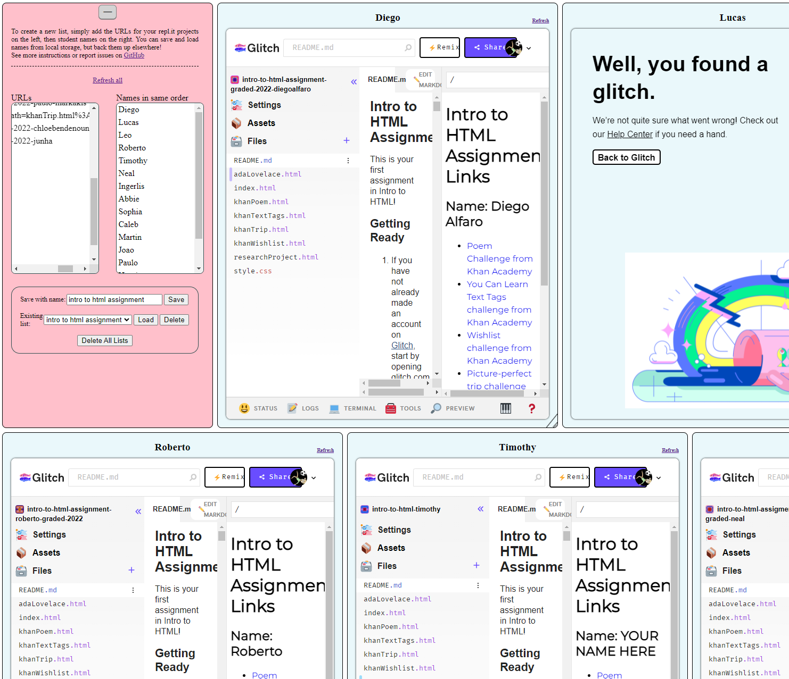

This really simple static website is designed to give teachers who are using the amazing online IDE https://www.repl.it or any similar site such as CodePen or Glitch.com a dashboard where they can easily see all of their students' code quickly.

Technically, the dashboard will work with any website that allows itself to be shown in iframes (just use the embeddable URLs for whatever tools you are used to!) but its designed with repl.it in mind.

You can find the deployed website at https://davidgriswoldteacher.github.io/replitdashboard/

## Instructions for Use

First, you need to gather a list of project URLs and the student names associated with them. I recommend saving them in a spreadsheet - URLs in one column, names in another - so you can easily copy and paste into the dashboard. You could probably use a google form and have students submit their name and the URL.

Once you have the URL and names collated, you can simply open the dashboard and paste the URLs in the first column and the names in the second. All student screens will automatically load, and you can resize each individual box using the bottom right-hand corner. Click the `[-]` button above the input areas to hide them and give you more room. Use Ctrl-F to quickly jump to a particular student.

You can refresh an individual screen by clicking the small refresh link in the upper right corner. You can also save and load lists into your local storage using the appropriate boxes. 

The screenshot below shows a snippet of it in action with projects at https://glitch.com

Hope it's helpful! If you have any issue, please report above!

